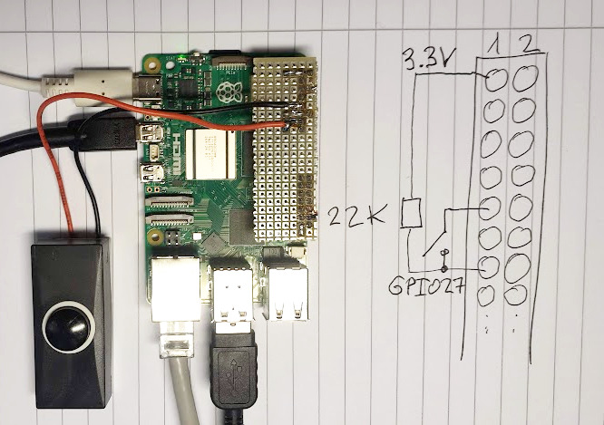

# C++ wrapper for libgpiod event framework

This wrapper turns the libgpiod event framework into a C++ callback framework.
This then allows the communication between classes where a class registers
a callback interface.

## Prerequisites

You need to install the libgpiod development package:
```
apt-get install libgpiod-dev
```

## How to compile

The build system is `cmake`:

```
cmake .
make
make install
```

## How to use it?

Please check out the example in the subdir example: `gpio_printer`.
This detects rising and falling edges on GPIO pin 27. To play with it just
connect a push button to it.



Press the button and you should see:
```
Press any key to stop.
Falling
Rising!
Falling
Rising!
Falling
```

## Credit

Bernd Porr
